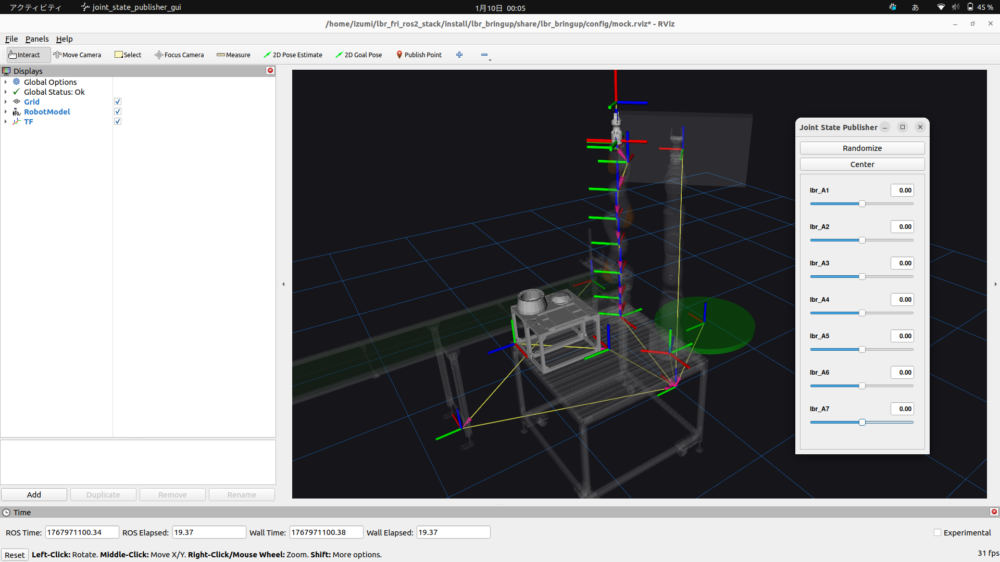

## 概要

2つのターミナルを使用して、以下を同時に起動します：
1. モックコントローラー + Joint State Publisher GUI
2. RViz可視化

## 起動手順

### Terminal 1: モックコントローラーとGUIの起動
```bash
ros2 launch lbr_bringup mock_gui.launch.py \
    model:=iiwa14(ここのオプションいれなくてもいいかも)
```

**利用可能なモデル:**
- `iiwa14` - KUKA LBR iiwa 14 R820


### Terminal 2: RViz可視化の起動
```bash
ros2 launch lbr_bringup viz.launch.py \
    rviz_cfg_pkg:=lbr_bringup \
    rviz_cfg:=config/mock.rviz
```


## 使用方法

1. 両方のターミナルでコマンドを実行後、Joint State Publisher GUIウィンドウが表示されます
2. GUIのスライダーを動かすことで、各ジョイントの角度を調整できます
3. RVizウィンドウで、ロボットモデルがリアルタイムで動作を反映します

## デモ画像



*Joint State Publisher GUIでロボットを操作している様子*


## 参考資料

- [清川先生のチュートリアルです](https://github.com/takuya-ki/lbr_fri_ros2_stack/tree/c17593f75e318a93c0bbfbda5e037e41782a8024)
- [LBR Stack公式ドキュメント](https://lbr-stack.readthedocs.io/en/latest/lbr_fri_ros2_stack/lbr_bringup/doc/lbr_bringup.html)
- [LBR Bringup GitHub](https://github.com/lbr-stack/lbr_fri_ros2_stack/tree/main/lbr_bringup)
